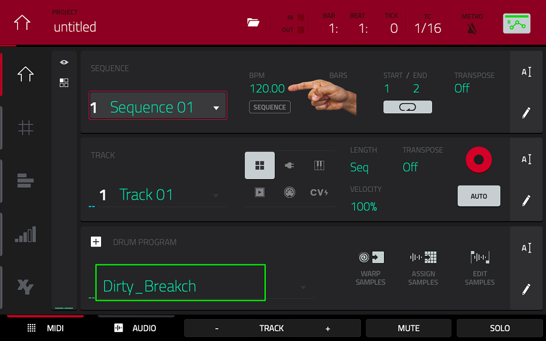
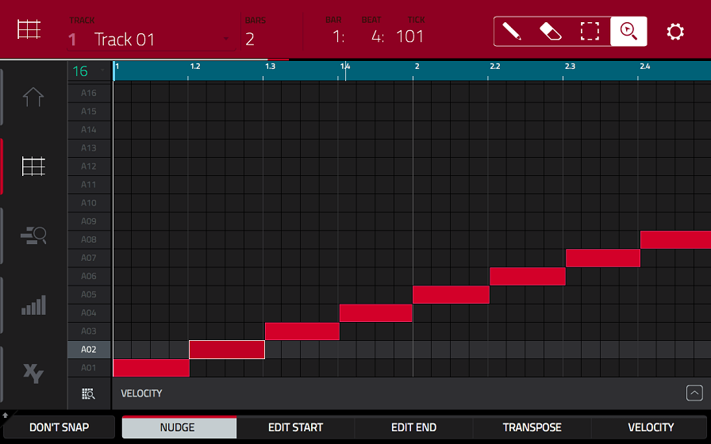
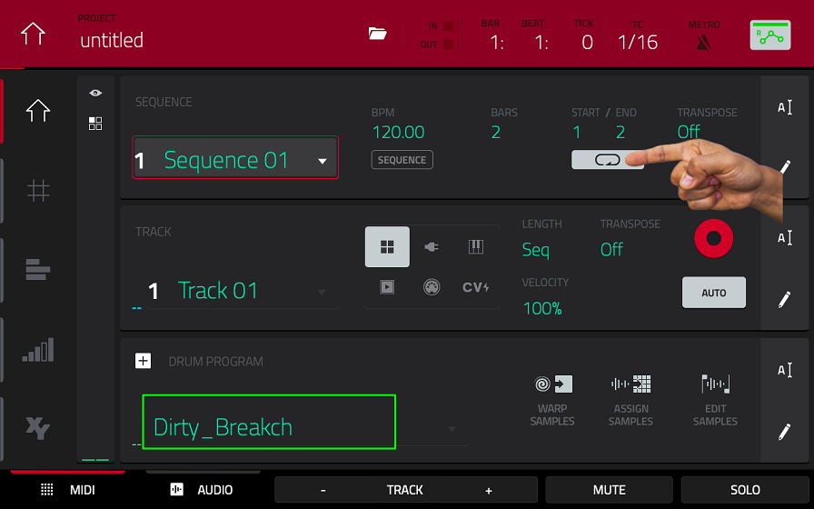
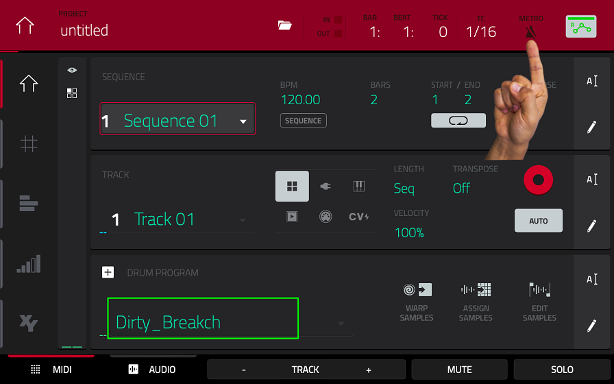

# Breakbeat Tutorial
## Setup
In this tutorial, you will learn how to ~~steal other people's work~~ how to process existing music in interesting ways using the ancient hip-hop technique known as slicing/chopping.

Open the **BROWSE** view by pressing **SHIFT + MENU**.
Switch to the Places tab and select the SD-card 3430...(no idea why it has that name).   
Within the breakbeat_tut folder, you will find a bunch of .wav files. Except for the Vittorio Gianni one, they are all short drum loops known as breakbeats.   
You can hear an audition of the samples by selecting them via touch or through the hardware controllers. There's at least one that you're already quite familiar with ;).  
  
Choose the sample you like the most and load it into your project by touching the LOAD icon in the bottom right corner of the display.

## Slicing

Press **SHIFT + MUTE** to switch into the **SAMPLE EDIT** view - the sample of your choice should already be selected.   
**Remember the number that is written under BPM.**  
We are going to cut the sample into a bunch of short slices that we'll later combine into a new arrangement.  
Switch into the chop mode by touching the **TRIM** icon in the bottom left corner.


There are multiple ways to slice your samples - today we'll slice by region.   
Select the **REGIONS** mode, which should slice your sample into 16 regions of the same length.   
You could go as detailed as 128 regions, but since we want to play our new arrangement by hand, 16 regions are perfect for our 16 pads. 


If you hit one of the pads, the corresponding region of your sample will play.  
Now you probably get what I'm aiming for!   


Before you start jamming though, you might like to adjust the regions a little bit. In this current mode, all the splices are linked at their start- and endpoints, so except for the first slice, we only have to adjust the endpoints. The second Q-LINK bank proves to be quite handy here: Every encoder changes the endpoint in different resolution, just try it and you'll get what I mean.   
Try to create slices that start with a strong transient (meaning a drum hit instead of silence) and end smoothly without a click.   
To achieve the latter, the waveform should be as neutral as possible at the end of your slice - try adjusting the zoom settings to get a closer look. 


Now all you have to do is to repeat this process for every single slice, which you can easily change with the big encoder once you touched the slice selector on the display. During this entire process, I'd recommend to go by ear and to constantly play your slices with the pads. In some cases, you might like to go for some broader adjustments as well and that's perfectly viable - one pad can be as short as a single snare hit or as long as an entire bar. Simply trust your feeling here - in my example I ended up with only 15 slices because I have made some of my slices much longer. 

## Converting the Slices into a Drum Program

Once you're satisfied with your setup, it's time to convert your slices to a new drum program. Press **SHIFT** and you'll notice that the icons at the bottom of the screen have changed.  
Tap on **COVERT**, which will open a new window. Make sure to select "New program with new samples" and check all of the boxes. The length of the bars for the new midi events depends on your sample, but for breakbeats it's usually two or four bars.


Touch the **DO IT** icon and let the MPC do its magic. Press **PLAY START** to hear your magnificent creation... it sounds like utter 💩. Do you still remember the tempo of your original sample? You have to adjust the tempo of your project accordingly! Press MAIN and double tap on the BPM selector next to Sequence 01 an enter your tempo. 



````
MASTER-BPM
Touching the SEQUENCE icon under the BPM selector changes the tempo to master-mode, which is the same for all sequences. 
We don't have to bother with that now. 
````
Have you forgotten the BPM of your sample? Don't worry, the original isn't gone. Just go back to the **SAMPLE EDIT**, press the big encoder and select the very first sample in the list. Change chop-mode back to trim-mode and you'll see the original tempo once again. 

```
CHANGING THE BPM
You might wonder how to proceed if you want to work with a different tempo than what your sample provides. 
To achieve that, you have to take a couple of additional steps. Before you slice your sample by region, you have to create a single slice for ideally every single transient - or as many regions as you can manage before your eventual mental breakdown. 

This is where threshold dependent automatic splicing can really help you out. 
After you've done that, convert your slices to a new program and create the corresponding MIDI events, just like in this tutorial. Now you have much more freedom to adjust the tempo in the MAIN view. 
Select your desired BPM and it should sound fine unless you go for some really extreme settings. Touch the pencil icon on the right side in the sequence section and select BOUNCE TO SAMPLE, which will create a new sample in the correct tempo without any warping artifacts. You can now chop up this new sample into regions like before. 
```
Your playback should now sound exactly like a loop of your original sample. If the timing is still off, you probably selected the wrong number of bars during the conversion to a new program.

## Resequncing the Slices

Press **SHIFT + MAIN** to go the **GRID** MIDI editor and you'll see all the neat MIDI events you have just created.   
As you can see, all the 16 pads are played in a ascending order, which restores our original sound. 



But now it's time to mess things up! You could draw new midi events inside the GRID view like a nerd, but instead you'll play your slices by hand to unleash your inner funk-demon. 

```
COLORING THE PADS
You might like to change the color of the pads for better readability. 
Press MENU and go to PAD COLOR. Change the mode to FIXED and SINGLE PAD. You can assign the selected color either by dragging it onto the pad or by simply playing the pad.
So much fancier.
```

```
PROCESSING THE SLICES
If you still got some time left, you might like to process your slices individually inside the PROGRAM EDIT. 
Press MENU and touch the icon. Switch to the SAMPLES tab. Simply tab one of the pads to change to the corresponding pad/slice. Even in this view, we can make a couple creative adjustments. Strictly speaking, all of the following changes do NOT affect the sample itself, but rather the pad it has been assigned to. 
For example, you could pitch your slice up or down via the SEMI(-tone) selector. This also changes the tempo (which can be desirable) unless you turn on the warp mode and enter the correct BMP from earlier. 
Now you'll get some pretty crazy warping artifacts when you change the pitch! This is how some of the more "out-there" electronic musicians like Arca do their sound design (but inside a DAW). Another neat effect is to reverse the whole sample using the REVERSE icon. If you want your slice to sound different every single time, you might fancy a look into the LFO tab, but I'll skip over that for now. You can check out the IDM tutorial if you're interested in that. 

Go to the EFFECT tab next. Here you can mangle your slice with up to four insert effects - you should be familiar with these from your DAW. How about adding a long reverb to just a single pad? 
I'm a big fan of the Granulator and the Talk Box effects (both inside the Harmonic category), the latter turns every sound into a very silly sounding human vowel. If four effects aren't enough for you, there are additional DRUM FX as well if you touch the EFFECTS tab again. 

You might run into a dilemma here - "Should I sacrifice my original slice for a reverse effect?" Thankfully, you don't have to choose between the two since you can copy a pad of your choice. While your still inside the PROGRAM EDIT, press and hold COPY until all the pads light up yellow. Tab the pad you want to copy - it should turn green. 
Your first pad bank is probably full, so let's switch to a different pad bank by pressing one of the red pad bank buttons above the pads and tab your destination pad - it should light up in red. You can now process these two pads seperately. 

Keep in mind that these effects are applied to single pads. If you want to add effects to the whole program, press MAIN, touch the little eyeball icon and touch the INSERTS field. 
```

Finally, it is time to record. Press **MAIN** and turn off loop mode via this little icon.




Now you can record for as long as you want. You might prefer to practice a small pattern before things turn serious. 

By default, the time correction is ON, which means that your trashy playing gets aligned to a grid to sound a little less trashy, but also more robotic. Press the **T.C.** button to open the time correction window. You can turn the time correction off if you feel jazzy enough, but if you'd like to use use it, make sure that the **TIME DIVISION** is set to a reasonable resolution such as 1/16 and lower. 

You can aid your playing further by using a metronome - you can open its settings here in the **MAIN** view.



Press the **REC** button - it should light up. Press **PLAY START** and you'll hear a four-beat count-in for you to get ready. Now play.
<p>
<br>
<br>
<br>
<br>
<br>
<br>
<br>
<br>
<br>
<br>
<br>
<br>
</p>
You probably messed that up.   
Don't worry, just hit the **UNDO** button and try again.   
When you're done, press **STOP** to stop our virtual tape machine. You can now go back into the **GRID** view to adjust your timing, to add new MIDI events etc. 

Maybe you also want to record your playing once again without overwriting the existing MIDI events. To do so, press the **OVERDUB** instead of **REC**. Your sequence is getting pretty long at this point, so you probably don't want to sit through its entirety during overdubs. You can skip the waiting game by adjusting the start of the loop - it's the third encoder in the last Q-LINK bank. 

Being put on the spot like that can be daunting for some and fortunately, there's another way to record. During your initial jams, you might have thought "Damn, that was a DOPE ASS BEAT, too bad I did record that!" With MIDI capture, you can easily recover that lost spark of genius: 
Press **SHIFT + REC** and these MIDI events from the past will be added after the playhead retrospectively. 

Your sequence might sound [something like this](audio/01.wav)

(The added glitch sounds and the super authentic vinyl crackle were taken from the internal sound library.)


