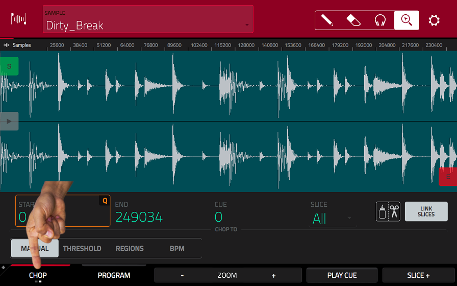

# Breakbeat Tutorial
## Setup
In this tutorial, you will learn how to ~~steal other people's work~~ how to process existing music in interesting ways using the ancient hip-hop technique known as slicing/chopping.

Open the **BROWSE** view by pressing **SHIFT + MENU**.
Switch to the Places tab and select the SD-card 3430...(no idea why it has that name).   
Within the breakbeat_tut folder, you will find a bunch of .wav files. Except for the Vittorio Gianni one, they are all short drum loops known as breakbeats.   
You can hear an audition of the samples by selecting them via touch or through the hardware controllers. There's at least one that you're already quite familiar with ;).  
  
Choose the sample you like the most and load it into your project by touching the LOAD icon in the bottom right corner of the display.

## Slicing

Press **SHIFT + MUTE** to switch into the **SAMPLE EDIT** view - the sample of your choice should already be selected.   
We are going to cut the sample into a bunch of short slices that we'll later combine into a new arrangement.  
Switch into the chop mode by touching the **TRIM** icon in the bottom left corner.

There are multiple ways to slice your samples - today we'll slice by region.   
Select the **REGIONS** mode, which should slice your sample into 16 regions of the same length.   
You could go as detailed as 128 regions, but since we want to play our new arrangement by hand, 16 regions are perfect for our 16 pads. 

If you hit one of the pads, the corresponding region of your sample will play.  
Now you probably get what I'm aiming for!   

Before you start jamming though, you might like to adjust the regions a little bit. In this current mode, all the splices are linked at their start- and endpoints, so except for the first slice, we only have to adjust the endpoints. The second Q-LINK bank proves to be quite handy here: Every encoder changes the endpoint in different resolution, just try it and you'll get what I mean.   
Try to create slices that start with a strong transient (meaning a drum hit instead of silence) and end smoothly without a click.   
To achieve the latter, the waveform should be as neutral as possible at the end of your slice - try adjusting the zoom settings to get a closer look. 

Now all you have to do is to repeat this process for every single slice, which you can easily change with the big encoder once you touched the slice selector on the display. During this entire process, I'd recommend to go by ear and to constantly play your slices with the pads. In some cases, you might like to go for some broader adjustments as well and that's perfectly viable - one pad can be as short as a single snare hit or as long as an entire bar. Simply trust your feeling here - in my example I ended up with only 15 slices because I have made some of my slices much longer. 

## Converting the Slices into a Drum Program

Once you're satisfied with your setup, it's time to convert your slices to a new drum program. Press **SHIFT** and you'll notice that the icons at the bottom of the screen have changed.  
Tap on **COVERT**, which will open a new window. Make sure to select "New program with new samples" and check all of the boxes. The length of the bars for the new midi events depends on your sample, but for breakbeats it's usually two or four bars.

Touch the DO IT icon and let the MPC do its magic. Press PLAY START to hear your magnificent creation... it sounds like utter 💩. Do you still remember the tempo of your original sample? You still have to adjust the tempo of your project accordingly! Press MAIN and double tap on the BPM selector next to Sequence 01 an enter your tempo. 
