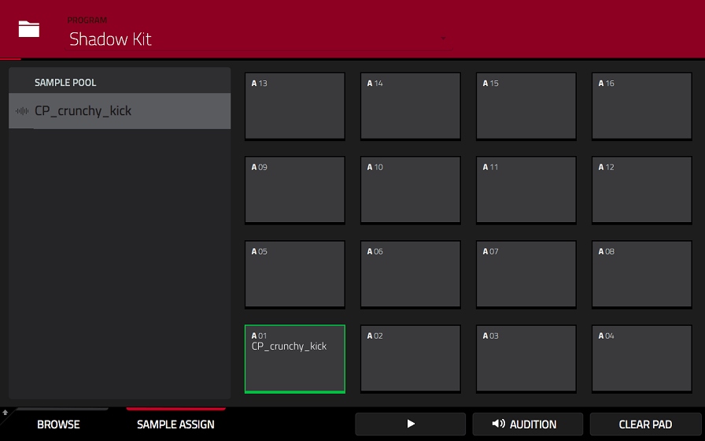
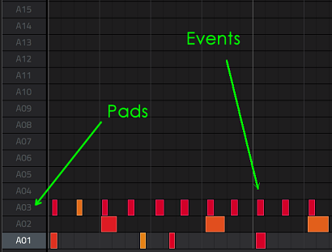
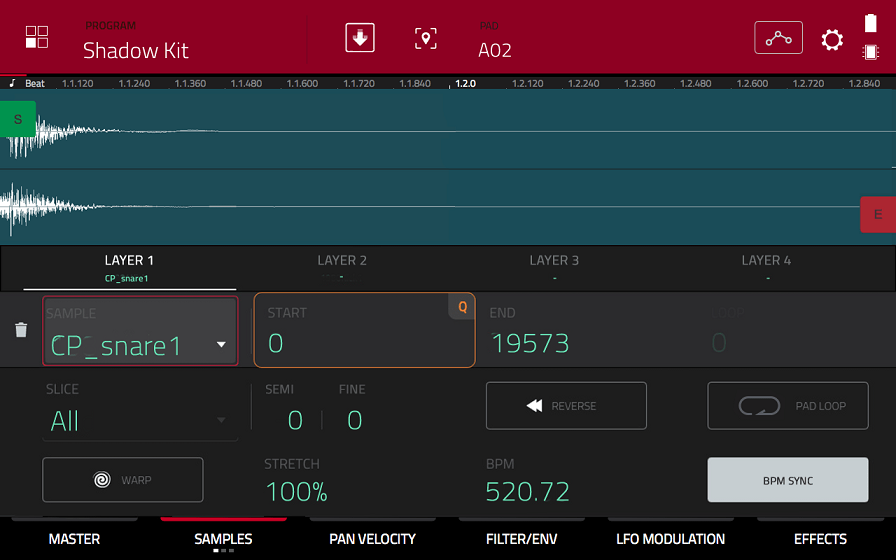
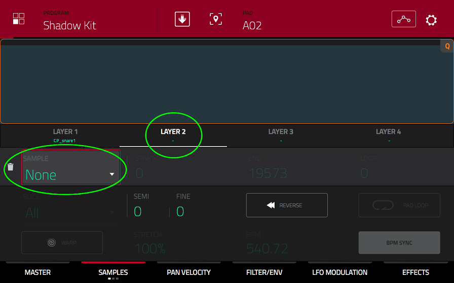
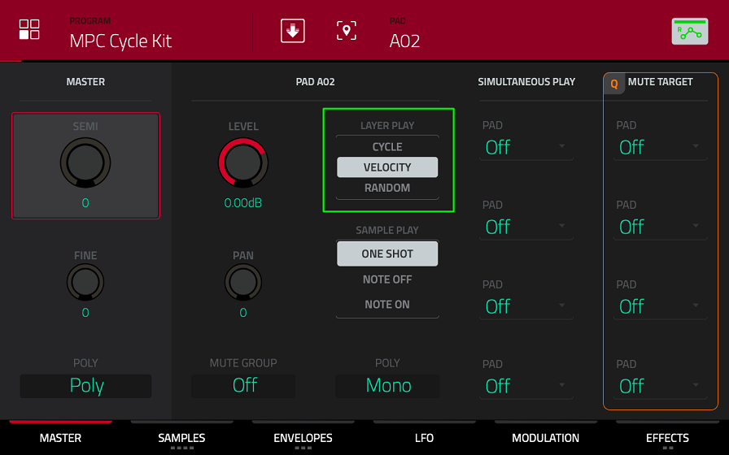
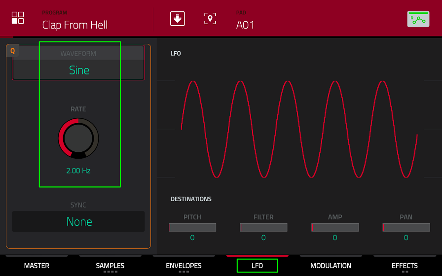
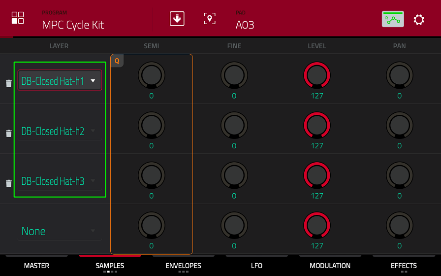
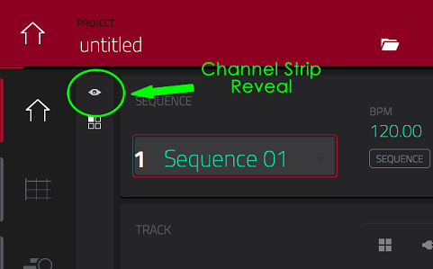
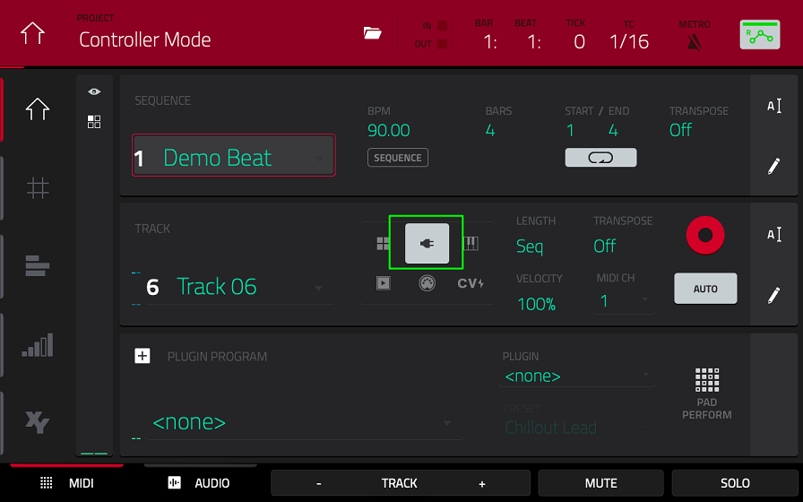

# IDM Tutorial

In this tutorial, you'll learn how to create a 90s IDM track to show your friends that you are very smart. 
In more general terms, we'll adapt the concept of eMeRgenCe to drum programming: You'll learn how to create a MIDI sequence which sounds different every time you play it. That is something the MPC was never meant to accomplish, but we'll do it anyways using a silly workaround. 
## Setup

First, let us create a simple backbeat.  
Go to the **BROWSE** view by pressing **SHIFT + MENU**.  
Switch to the **Places** tab, open the SD card and select the idm_tut folder without opening it.  
Press **SHIFT** and select touch the **LOAD ALL** icon in the bottom left corner.  
This loads all the samples we are going to use into our project. For this kind of fast-paced drumming, we need short and snappy samples, so drum machines sounds like your standard CR78, 808 and so on work best. If you feel a bit more creative, you can also salvage my samples folder in the root folder of the SD card.

## Building the Drum Kit

Switch to the **SAMPLE ASSIGN** tab at the bottom of the screen and drag the samples "Kick 808 Beamz 1" and "Snare 808 1" onto two different pads of your choice. 



You can now play a kick and a snaredrum sound by banging on the pads! That's already enough for a simple back beat.   

### Drawing MIDI Events

Press **SHIFT + MAIN** to move into the **GRID** view, which is the MPCs MIDI editor.  

  

Use the pencil icon to draw a VERY SIMPLE pattern - we'll fill it up later. If your not familiar with drum programming at all, 
[read this book](https://ia902900.us.archive.org/8/items/DrumProgrammingACompleteGuideToProgramAndThinkLikeADrummer/Drum%20programming%20-%20a%20complete%20guide%20to%20program%20and%20think%20like%20a%20drummer.pdf) or just put the kick drum on the on-beats (1, 1.3, 2. 2.3) and the snare drum on the off-beats (1.2, 1.4, 2.2, 2.4).  

You might like to add a little "fill" by speeding up this pattern for the last two beats. You can change your tempo/bpm in the **MAIN** view inside the **SEQUENCE** section. Press **PLAY START** and **STOP** to ... well, I guess you can figure that out on your own (PLAY starts where you left off, PLAY START always starts at the beginning). It should sound [somewhat like this.](audio/01.WAV)

### Round Robin

Sounds pretty boring right?   
We can make a couple of subtle changes to make this more listenable. First, we're going to use a feature you'll find in most music software known as ROUND ROBIN. 
When a real drummer plays his snare or kick, the drum won't always sound the same since there are real instruments and humans involved instead of ones and zeroes. This is also true for the classic drum machines because of their analog oscillators! We can imitate this behaviour by cycling through multiple samples of the same sound that differ in very subtle ways - that's round robin. 

Press **MENU** and go to the **PROGRAM EDIT**. Switch to the **SAMPLES** tab. If you bang your pads once again, you'll see that the sample on display changes.



Let's start with the kick, switch to the Layer 2 tab and choose "Kick 808 Beamz 2" in the sample selector. 



Go back to the **MASTER** tab and switch the **LAYER PLAY** mode from **VELOCITY** to **CYCLE**. 



Play your kick-pad and try to hear the difference.   
Can you hear it?   
The hi-hat-ish white noise transient is missing for the second sample and the release is a bit longer. In CYCLE mode, all the layers from 1 to 4 are cycled through in an ascending, never changing order. The first time the pad gets triggered, it'll play layer 1, the second time layer 2 and so on. You can also choose the **RANDOM** mode, which selects one layer randomly just like its name suggests. 
You can choose the mode that you like better for your pattern.

### LFO Modulation
In addition to round robin, we can also spice things up with some LFO modulation.  
Switch to the **LFO** tab, choose **Noise** as your **WAVEFORM** and reduce the **RATE** to its lowest setting.   



You can think of the LFOs ("low-frequency-oscillator") with this setting as a number generator that gives out a random value every time a pad is tirggered. You can assign the LFO to the four destinations on the left by dragging them up. 

Try out some of the extreme settings and here what they do!  
Then dial them down to a more subtle setting if you like. You might not notice the stereo panning if you use the speakers and I'd advise to keep everything bassy like our kick drum in the middle of the stereo field for a better translation in less-than-ideal playback situations. The **AMP** destination is of particular interest, because it changes the volume of the sample/pad - now we don't have to bother with setting the velocity in the **GRID** view!

Go through all of these steps for your snare drum as well.
You can fill all the layers since we got plenty of snare samples! 
Your final result should [sound like that.](audio/02.WAV) 

It's a subtle difference, but subtlety matters a great deal. 

### Emergence

Round robin is also immensely important for what this tutorial is actually all about - emergence. 
Stay in the **PROGRAM EDIT** and select one empty pad where you'd like to add another kick drum. This additional kick-drum will be used for "ghost notes" or "Zwischenschläge", which are quieter, less important hits between the big main hits you just programmed before.   

For our example though, these ghost notes will change our pattern to quite a dramatic degree! Add "Kick 808 Short 1" to Layer 1 of our new pad and "Kick 808 Short 2" to Layer 2. Proceed to set up round robin and **LFO** modulation as before. Now load some other random sample into Layer 3 and 4 - it really does not matter which. Touch the **SAMPLE** tab again to switch to the second sample view. 



Here, reduce the level of Layer 3 and 4 to zero and bang your ghostly kick pad a bunch of times.   
Can you figure out what happens?

```
NON-HARMONIC DISTORTION
I like to give short kicks like that some extra presence by adding some non-harmonic distortion to them. 
You can do that by going to PROGRAM EDIT/EFFECTS with the right pad selected. 
Add the AIR Lo-Fi effect and adjust its settings by touching the little pencil icon. 
Play around with the settings until you’re satisfied. 
Don't forget to check out the LFO tab as well!
```

When the silenced samples get triggered through round robin you'll hear... nothing. How annoying! 

This is my workaround for probabilistic MIDI events on the MPC. The MIDI events still get triggered - you just don't hear them! For this behavior, I prefer the RANDOM mode for added unpredictability. Since we can only use four sample layers, our probability values in **RANDOM** mode are limited to 100%, 75%, 50%, 25% and 0%(lel). 

```
POLY MODE
When you use longer samples with this method, you might run into the issue of the sound being cut off by a silent MIDI event. To avoid this behavior, you can set your pad's POLY mode from Mono to Poly inside PROGRAM EDIT/MASTER. Now the MIDI events won't cut each other off.
```

Drawn in ghost notes between your main kicks in the GRID view and repeat the entire procedure for a ghost-snare-pad. 
You can use the "Snare 808" samples that you haven't used for your main snare. Add ghost snares between your main snare hits and [something like this should emerge.](audio/03.WAV)

Good job! Now the computer comes up with a new pattern for every single loop! Gone are the days of MIDI editing! 

```
MUTE GROUPS
Different pads can cancel each other out through mute groups. 
You can assign mute groups in PROGRAM EDIT/MASTER. 
For this example, I added the snares to one mute group. 
```

You can also try something more extreme by drawing in a "pattern" that only consist of our probabilistic drums! 
You can also just [listen to my recording.](audio/04.WAV)

It sounds interesting I guess, but it's a bit too unstructured for my taste.
 This is why I prefer to use randomness only in moderation. 

Let's return to your previous pattern instead and add some hi-hats. Go back into the **PROGRAM EDIT** and choose a new empty pad. Load the samples "Hat CR78 1" into Layer 1 and "Hat CR78 Open" into Layer 2. Repeat all the steps you did for our previous ghostly pads - including the two (or just one) silent random samples. 

Does your sequence sound [similar to this?](audio/05.WAV)

```
REVERB
I added a Reverb Effect to my main snare using the same approach as with the non-harmonic distortion.
```

And that's pretty much it. Listen back to the [first example](audio/01.WAV) - we've come quite a long way!

Next, if you've got the time, we can add some sounds with the lowest "probability" of 25% to add further variations. 
For [this next example](audio/06.WAV) I added a clap and a crash cymbal. 
There are also two rimshot samples left that you can play around with.
The weird pitch drift on the cymbal was achieved through a sample-and-hold LFO at a high rate. 

### Adding Effects to All Samples
To give the whole thing a bit more analog flavor, you can add effects to the entire program. 
To do that, press **MAIN** and touch the little eyeball icon. 



Touch the **INSERTS** field - here you can add your effects.
 I'd suggest to cut the higher frequencies a bit with a lowpass filter and to add some subtle distortion with a Tube Drive afterwards. 

## Instruments
Now the only thing missing are instruments, but this is really a topic for the next tutorial. 
I'll be as brief as possible: Change to Track 02 in the **MAIN** view. Touch the little plug icon in the **TRACK** section. 



You can now choose a **PLUGIN** and a **PRESET** in the **PLUGIN** section underneath. 
You can simply use the pads to play or attach another MIDI device. You can adjust what the pads play via the **PAD PERFORM** in the **PLUGIN** section - don't bother if you don't understand any of it though. 

If you want to add another plugin program, you have to change to Track 03 and add another instance of a plugin by touching the little **+** icon next to **PLUGIN PROGRAM**. Any changes made here will also affect Track 02 if you don't add a second program!

## Swing

There's one final adjustment to make all of this sound more human - we can sweeten our dope ass beat with some MPC swing. Press the **T.C.** button to bring up the time correction window. 


Swing moves your MIDI events slightly off grid to create a human feel - you can control the intensity with the **SWING** parameter, but for something so fast I'd rather not overdo it. Check out the changes in the **GRID** view after you applied your setting either to **ALL TRACKS** or just to the one currently selected (**DO IT**).

[And that's it.](audio/07.WAV)   

  

I haven't talked about sound design at all, so this still sounds kinda rough, but you get the general idea.   
God, I'm tired and I bet you're too.   
You did great.   
If you want to continue this loop, I urge you not to miss the third tutorial.   
Don't forget to save your project ass "yourSurname"-IDM.

