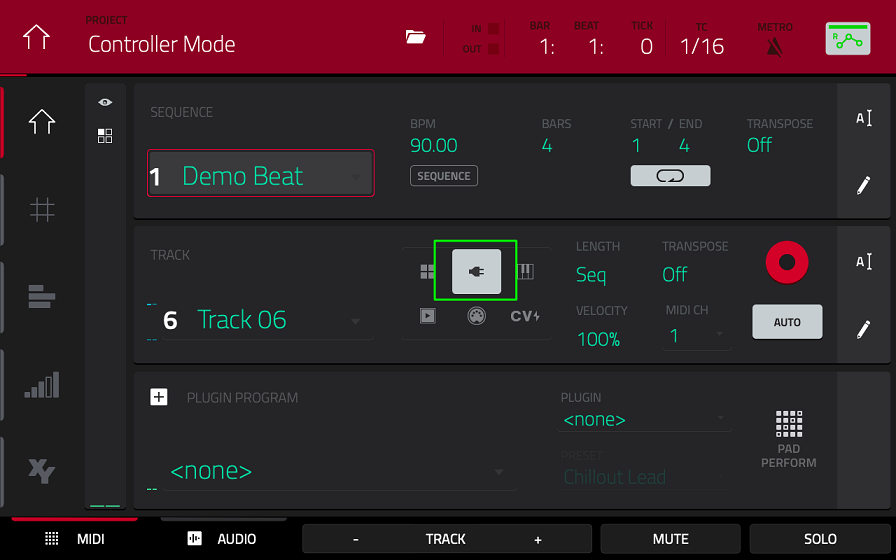

# Song Mode Tutorial

Here's to the king of all tutorials: **Song Mode**.  
With this, I won't hold your hand. I'll only provide the information that you need to string multiple sequnences together, but it's up to you to fill them. You could of course also open up my own song "song-winter" and fix its sloppy finale, but that'd be quite lazy. If you feel completly uninspired, it might be a good idea to go through one of the other two tutorials. For my part, I'll continue the gnarly IDM loop from the second tutorial and turn it into something even more nasty 🤮. 

## Additional Basics
This is the basic information that you need to know to quickly fill a loop
### Recording
You switch on recording mode by pressing the **REC** button.   
If you want to record **OVERDUBS**, there's a switch right next to it.   
To use MIDI-capture similar to how you would in Ableton Live, press **SHIFT + REC**.  

### MIDI Editor
The MPCs MIDI editor is known as the **GRID** view and you open it via **SHIFT + MAIN**.   
It's pretty self explanatory. 

### Track Types
There are multiple types of tracks in the **MAIN** view: DRUM, PLUGIN, KEYGROUP, CLIP (audio), MIDI (external) and CV tracks.   
The first four ones are probably of more interest to you. You can switch the track type here:

### PROGRAM EDIT
You can the program inside the **PROGRAM EDIT** which you can access through the **MENU**.   
Remember though that one single program can be assigned to multiple tracks.   
Changing the program will change it for all the tracks that it's assigned to.   
The **PROGRAM EDIT** looks different dependant on the the track type and plugin.

### Automation
You can record automation by toggeling this weird icon from **R** for **R**ead to **W** for **W**rite. 

  
You can edit your recording inside the **LIST EDIT** from the menu, but it's a huge pain and I'd try to avoid it as much as possible. There's a somewhat hidden way to edit automation inside the **GRID** view as well.   
Touch **Velocity** and turn the big encoder to cycle through the different paramters you've recorded automation for.

### Time Correction & Swing
You can apply swing and change the time correction setting by pressing the **T.C.** button.

## Building the Song
### Muting Tracks
By now, you should have completed your first loop/sequence.   
Now before you go further, it might be a good idea to explode your drum track.

That sounds quite dramatic, but all it means is that you're splitting up your drum track into individual tracks for each pad.   
To do so, go to **MAIN** and touch the pencil icon in the **TRACK** section with the right track selected and you'll find a bunch of options of how to process your track.   
Maybe the other options are of interest to you as well.

Now it is much easier to mute individal parts of your drum kit such as the snare drum to create a new sequence. 

After all, this is the easiest way to create a longer musical structure: Muting and un-muting tracks.   
Maybe you want to start with your bassline and slowly add a new part with each sequence?   
This might seem like a dull and uninspired way to make music, [but it can take you very far if done in a clever way.](https://www.youtube.com/watch?v=m5H-YlcMSbc)

To copy your sequence, touch the pencil icon in the **SEQUENCE** section.   
You can also copy a selection of MIDI events via **EVENTS**. The sequence selector jumps automatically to your new sequence. 

Now press **MUTE** to switch between the **PAD MUTE** and **TRACK MUTE** view.   
You might wonder why I suggested to explode the drum track despite the existence of a dedicated **PAD MUTE** view.   
The reason is that the **PAD MUTE** doesn’t work as it should – at least in my opinion.   
When you mute a pad, it applies to ALL tracks – pretty pointless, if you ask me.   
It get’s even more confusing when you record the automation of muted and unmuted pads!   
Tracks are just easier to work with in every way. 
Maybe you can build a nice intro this way?   
Don’t feel restrained by this approach though – write new music for the new sequences as well if you want!

### Playing with Sequences
By now, you should have assembled a bunch of sequences. You probably noticed already that you can chain sequences together if you select a new different sequence in **MAIN** while the music is playing. 

There’s another more convenient way to play around with sequences in a noncommittal way:  
Press **MENU** and go to **NEXT SEQUENCE**. 

In this view, every sequence is assigned to a pad, which makes it very easy to switch between them.   
By default, the selected sequence is played in its entirety before the next sequence starts, but you can also jump directly by touching the **NEXT BAR** and **SUDDEN** icons.  
This view is quite handy for experimentation and live performance, but maybe you want to build a version of your track that doesn’t change for all eternity – this is what the SONG view is for. 

### Creating the Song
You can find the **SONG** view inside the **MENU**.  

Again, you see that every sequence has been assigned to one of the pads.   
Press **REC** + a pad of your choice to add the corresponding sequence to the list on the left – this is how you chain sequences together. 

For each entry, you can change the sequence, the number of loops played, the BPM and the number of bars played for each loop. 

Select the first entry and press **PLAY** to hear the entire thing!  
You can now either convert the song to a single sequence by tapping **CONVERT > SEQ** or you directly **EXPORT** a rendered .wav file onto your thumb drive or SD card. 

For me, the result sounds again [like this.](audio/01.wav)  
  
This really isn’t my genre…  
Anyways, congratulations! You finished your own song. Don't forget to save it as "yourSurname-song".
